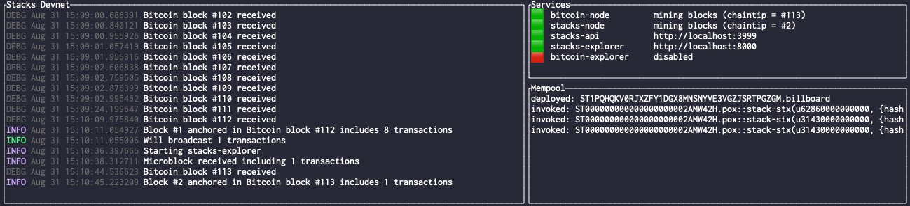
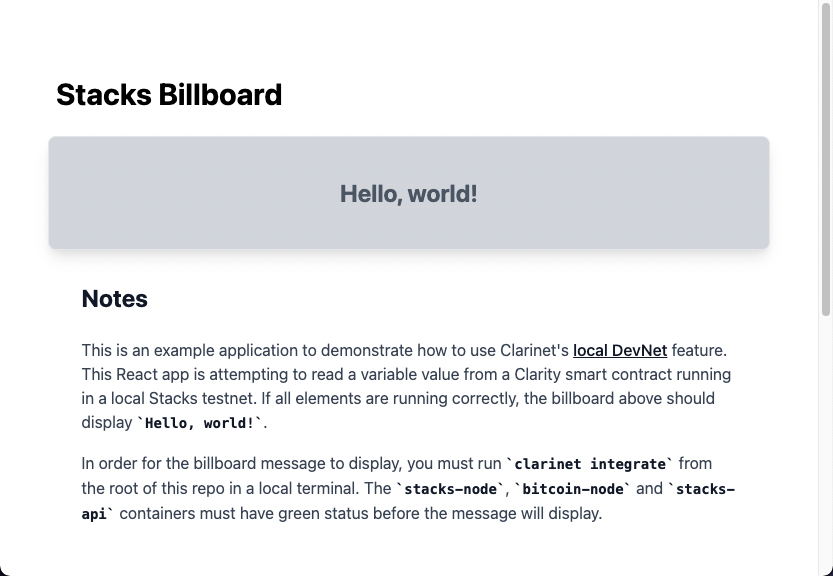

# Stacks Billboard

This project is an example full-stack application that uses Clarity smart contracts, Stacks.js, and React to read values from the Stacks blockchain through the Stacks API. The project uses [Clarinet](https://github.com/hirosystems/clarinet) to run a local development environment, allowing you to test the frontend against a running Stacks blockchain without interacting with a public testnet.

## Quick start

Make sure you have the [dependencies](#dependencies) installed.

Clone this repository to your local machine and install dependencies:

```sh
git clone https://github.com/pgray-hiro/stacks-billboard && cd stacks-billboard
yarn install
```

To run this app locally against the Clarinet DevNet, you'll need to have two terminal windows open (or use a virtual terminal like screen). With the repository cloned locally, in the first terminal run the following command from the root of the local repository:

```sh
clarinet integrate
```

Note that while you can run the frontend before the local DevNet is fully launched, the frontend will display an error message from the local API. You should wait until the `stacks-node`, `stacks-api`, and `bitcoin-node` containers all have a green status in the DevNet dashboard before launching the frontend.



In the second terminal, start the frontend by running the following commands from the root of the repo:

```sh
yarn run dev
```

If the local DevNet is running, the React frontend will display the message `Hello, world!`.



## Dependencies

This project has the following dependencies:

- [Clarinet](https://github.com/hirosystems/clarinet)
- [Docker](https://docs.docker.com/get-docker/)
- Node.js
- Yarn
